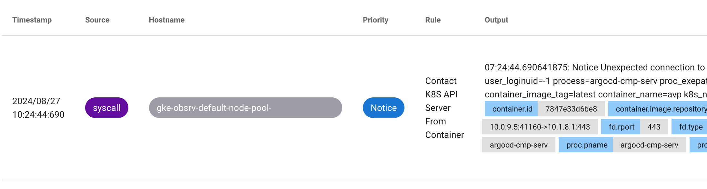
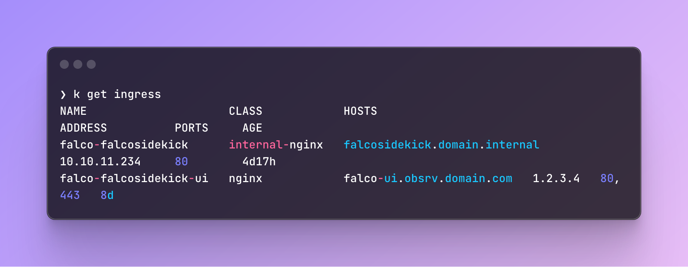
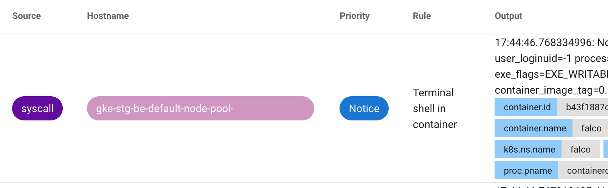
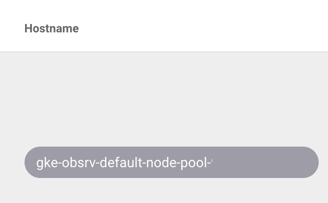
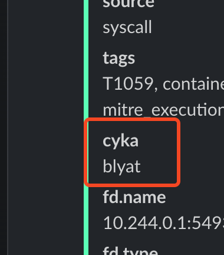
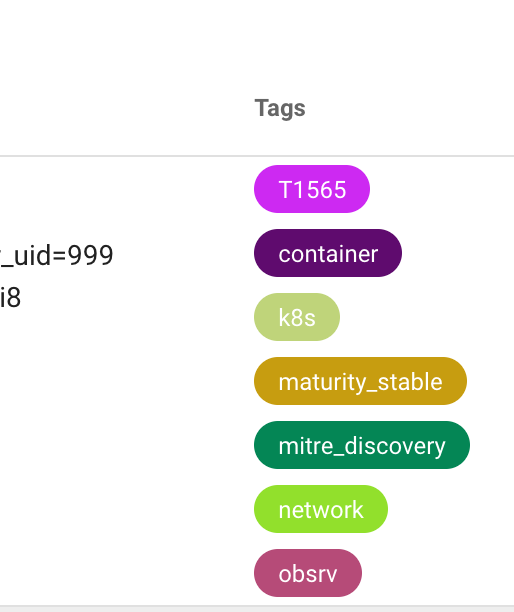
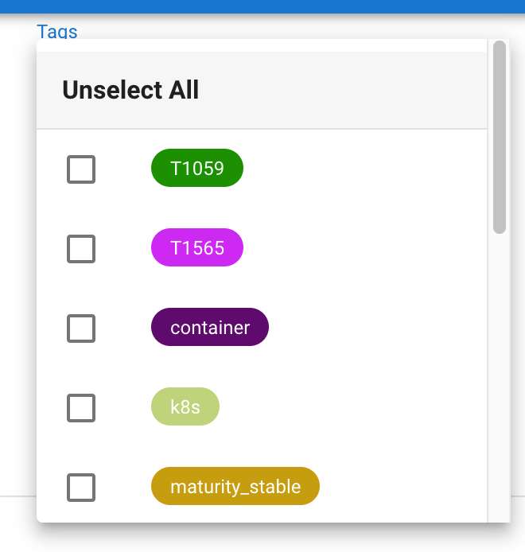

# Multi Cluster Falco
Falco offers a nice Web UI and we wanted all our clusters to report to the same interface instead of having a `falco.$ENV.domain.com` domain for each environment.
In this short tutorial I'll deploy Falco on our `staging` and `obsrv` (observability) clusters and show you how to centralize alerts to a single cluster.

## Setup

### Observability
We install Falco using Terraform and Helm. Here's a slim version of our Falco values file:
```yaml title="falco/values.yaml"
tty: false

falcosidekick:
  enabled: true

  webui:
    enabled: true
    replicaCount: 1

    redis:
      enabled: true

  config:
    existingSecret: "slack-webhook"
    extraEnv:
      - name: SLACK_WEBHOOKURL
        valueFrom:
          secretKeyRef:
            name: slack-webhook
            key: slackWebhookUrl
    slack:
      channel: "alerts"
```

In this setup we do the following:

- Enable the Falco Sidekick
- Enable the WebUI
- Enable Redis (enabled by default once you enable WebUI)
- Configure a Slack webhook and channel to send alerts to

Now we have a Falco UI. To expose this UI internally, we are using an `ingress`. You can configure it under `falcosidekick.webui.ingress`:
```yaml
    ingress:
      enabled: true
      ingressClassName: nginx
      host: "falco-ui.${base_domain}"
      tlsEnabled: true
      # annotations:
        # cert-manager.io/cluster-issuer: "letsencrypt"
        # <Your annotations here>
      hosts:
        - host: falco-ui.${base_domain}
          paths:
            - path: /
              pathType: Prefix
      tls:
        - secretName: falco-ui-tls
          hosts:
            - falco-ui.${base_domain}
```

In its current form, you will have Falco, Sidekick and WebUI ready and going. You should already be able to see various alerts:



#### Prepare Obsrv Falco For Incoming Falco Events From `Staging`
Now that we have the basic setup ready, we need to configure Falco to accept events from our other cluster. To do this, all we need to add is another `ingress`.
Under `falcosidekick.ingress`, we added:
```yaml
  ingress:
    enabled: true
    ingressClassName: internal-nginx
    annotations:
      nginx.ingress.kubernetes.io/proxy-read-timeout: "600"
    hosts:
      - host: falcosidekick.domain.internal
        paths:
          - path: /
            pathType: Prefix
    tls: null
```
We use `nginx-ingress` to create internal ingresses between our clusters. The above configuration will allow my `staging` cluster to communicate with the Falco sidekick on `obsrv` through the `falcosidekick.domain.internal` url. Running `kubectl get ingress` will show both of our ingresses:



### Staging
Our staging setup will be simpler. Let's jump right into the Helm values:
```yaml
falcosidekick:
  enabled: true

  webui:
    enabled: false

  config:
    webhook:
      address: "http://falcosidekick.domain.internal"
      method: "POST"
      checkcert: false
```

In this configuration we:

- Enabled the Sidekick
- Disabled the WebUI (since we'll be using the `obsrv` WebUI only)
- Configured a webhook to send events to our Falco ingress

That's it! Looking at our WebUI, we can see events coming from `staging`:



## Making Events "Cluster-Unique"

Now that `staging` is sending events to `obsrv`, it will be hard to tell the alerts apart. One "built-in" way is to simply look at the hostname:



It's not perfect, but assuming your nodes are named after the cluster name, this might be good enough.

### Custom Fields
Falco actually gives you the option to configure `customfields` under `falcosidekick.config`:
```yaml
  config:
    customfields: "cyka:blyat"
```

This will add the above key-value to the Falco events. This is how it would look in Slack for example:



It would also appear in the WebUI.

#### Staging Config
In staging or any "non-main" cluster, add `customfields: "env:${env}"` (or whatever label you want).

#### Obsrv Config
We can't use `customfields` in the main cluster as it would override the custom field arriving from `staging`. For example, if you configre:
`customfields: env:stg` in staging, and `env:obsrv` in `obsrv`, the result would be that all events come with a custom field of `env:obsrv`.

To fix this, use `templatedfields` which uses Go templating:
```yaml
config:
  templatedfields: 'env:{{ or (index . "env") "${env}" }}'
```
(since we're passing the `env` variable from Terraform, we had to escape it, your config may vary). 

That's it, this would allow you to get custom fields for each environment.

### Custom Tags
This method is a lot more of a "hack". Before you continue, check if this feature was [already implemented](https://github.com/falcosecurity/falcosidekick/issues/971) as I opened an issue for it in the Falco repo.

To understand this workaround let's first understand Falco rules on a basic level. Here's a rule example:
```yaml
- rule: Contact K8S API Server From Container
  desc: >
    Detect attempts to communicate with the K8S API Server from a container by non-profiled users. Kubernetes APIs play a 
    pivotal role in configuring the cluster management lifecycle. Detecting potential unauthorized access to the API server 
    is of utmost importance. Audit your complete infrastructure and pinpoint any potential machines from which the API server 
    might be accessible based on your network layout. If Falco can't operate on all these machines, consider analyzing the 
    Kubernetes audit logs (typically drained from control nodes, and Falco offers a k8saudit plugin) as an additional data 
    source for detections within the control plane.
  condition: >
    evt.type=connect and evt.dir=< 
    and (fd.typechar=4 or fd.typechar=6) 
    and container 
    and k8s_api_server 
    and not k8s_containers 
    and not user_known_contact_k8s_api_server_activities
  output: Unexpected connection to K8s API Server from container (connection=%fd.name lport=%fd.lport rport=%fd.rport fd_type=%fd.type fd_proto=%fd.l4proto evt_type=%evt.type user=%user.name user_uid=%user.uid user_loginuid=%user.loginuid process=%proc.name proc_exepath=%proc.exepath parent=%proc.pname command=%proc.cmdline terminal=%proc.tty %container.info)
  priority: NOTICE
  tags: [maturity_stable, container, network, k8s, mitre_discovery, T1565]
```

The `tags` field is available in the Falco UI:





Adding custom tags would add some benefits, for example when you want to filter between alerts in different environments.


There are two sidecar containers which are related to Falco rules:

- `falcoctl-artifact-install` - An init container that fetches the rules from Falco's repo. This is how you get the default rules under `/etc/falco` inside of the Falco pod.
- `falcoctl-artifact-follow` - A sidecar container that checks whether new rules were added to the repo.

You can customize each sidecar container with various settings like which repo to pull from, interval for checking, etc.

To achieve what we need, we basically need to disable the `falcoctl-artifact-install` sidecar, and mimic its actions in a custom init container. Here's what you need to do:

Disable the `falcoctl-artifact-install` sidecar (it's enabled by default):
```yaml
falcoctl:
  artifact:
    install:
      enabled: false
```

Now we need to add our own custom initContainer. You can go any way you like about it, but we just used an ad-hoc bash script to achieve this:

```yaml
extra:
  initContainers:
    - name: falco-artifact-install-tag-patch
      image: mikefarah/yq:latest
      env:
        - name: TAG
          value: ${env}
        - name: RULES_DIR
          value: "/etc/falco"
        - name: FALCOCTL_CONFIG
          value: "/etc/falcoctl/falcoctl.yaml"
      command: ["/bin/sh"]
      args:
        - -c
        - |
          #!/bin/sh

          # Install falcoctl
          LATEST=$(wget -O- https://api.github.com/repos/falcosecurity/falcoctl/releases/latest | yq '.assets[] | select(.name == "falcoctl_*_linux_amd64.tar.gz") | .browser_download_url')
          wget $LATEST -O falcoctl.tar.gz
          tar -xvf falcoctl.tar.gz

          install -o root -g root -m 0755 falcoctl /usr/local/bin/falcoctl

          # Add the Falco index
          falcoctl index add falcosecurity https://falcosecurity.github.io/falcoctl/index.yaml

          # Fix bug where falcoctl would fail to pull from the registry due to auth error
          # Not required after falcoctl 0.9.1
          yq eval 'del(.registry.auth)' -i $FALCOCTL_CONFIG

          # Install falco-rules artifact
          falcoctl artifact install falco-rules:3 \
            --allowed-types rulesfile,plugin \
            --resolve-deps \
            --rulesfiles-dir /rulesfiles \
            --plugins-dir /plugins || { echo "Failed to install falco-rules"; exit 1; }

          # Copy the installed rules to the shared volume
          cp -v /rulesfiles/falco_rules.yaml "$RULES_DIR/patched_falco_rules.yaml"
          echo "Copied rules to $RULES_DIR"
          ls -la "$RULES_DIR"

          # Add TAG to the tags list in falco_rules.yaml
          yq eval --inplace '.[].tags += ["'$TAG'"]' "$RULES_DIR/patched_falco_rules.yaml"
          echo "Added tag '$TAG' to patched_falco_rules.yaml"
      securityContext:
        runAsUser: 0
        runAsGroup: 0
      volumeMounts:
        - name: rulesfiles
          mountPath: /rulesfiles
        - name: plugins
          mountPath: /plugins
        - name: rulesfiles-install-dir
          mountPath: /etc/falco

mounts:
  volumes:
    - name: rulesfiles
      emptyDir: {}
    - name: plugins
      emptyDir: {}

  volumeMounts:
    - name: rulesfiles
      mountPath: /rulesfiles
    - name: plugins
      mountPath: /plugins
```

!!! note
      You might not need to patch the `/etc/falcoctl/falcoctl.yaml` file since a fix was [already implemented](https://github.com/falcosecurity/falcoctl/pull/627), but not yet released as of writing this guide.

Let's go over what this script does:

- Falco Helm values allow you to add extra initContainers under `extra`.
- We use the `yq` image as is it very light-weight (7mb) and contains all of the tools we need (`wget`, `yq`).
- We install `falcoctl` per Falco's official instructions. We fetch the latest release, download the `tar.gz`, extract and install it. Please note that we fetch the `amd64` version in case you are working on a different arch.
- We add the Falco index, which is the default index and contains all of the default rules.
- We install the rules and plugins to the `/rulesfiles` and `/plugins` folders.
- We copy the default rule file `/rulesfiles/falco_rules.yaml` to the `/etc/falco` folder under a new name: `patched_falco_rules.yaml`.
- We use `yq` to add our custom tag to all rules (`${env}`)
- Using the `mounts` option in the values file, we create two Volumes and two VolumeMounts that would otherwise be created if we didn't disable `falcoctl artifacts install`. We also mount them inside of the InitContainer.

> [!warning]
>Since we are adding a new file to `/etc/falco`, we also need to add it to the `rules_files` under `falco.rules_files`:
>```yaml
>falco:
>  rules_files:
>    - /etc/falco/patched_falco_rules.yaml
>    - /etc/falco/falco_rules.yaml
>    - /etc/falco/falco_rules.local.yaml
>    - /etc/falco/rules.d
> 
>  rule_matching: first
> ```
> It's important to put the patched file **first** and add `rule_matching: first` (although it's the default setting). 
> This would prevent seeing duplicate alerts from the original `falco_rules.yaml` file.

#### Issues With This Hack
We encountered one problem with this workaround which was `falcoctl artifacts follow`. This sidecontainer monitors the falco rules repo and updates the rule files when there is a new release. This would cause our `/etc/falco/falco_rules.yaml` file to be overridden when there is an update.

Our workaround was explained in the annotation above, which showed how we simply rename our rules file to `patched_falco_rules.yaml` as well as set `rule_matching: first`, to avoid duplicate alerts.

> [!info]
> The disadvantage with this approach is that you wouldn't know when new rules are added.
> We are fairly ok with the trade-off for a few reasons:
> 1. New rules are only added evey few months (simply looking at the rules repo releases page).
> 2. When new rules are added, the would still trigger but wouldn't show our custom tag, which is ok, it would simply mean we need to restart our Falco pods for the initContainer to do it's job.
> 3. This is temporary. As mentioned previously, this feature was already [requested](https://github.com/falcosecurity/falcosidekick/issues/971)

That's it for our Falco adventures for now. I'm definitely still learning how to use this tool, but even on a basic usage like ours we had to "enrich" it in various ways.
Hope this was helpful :)
