I wanted to test out [Kargo](https://kargo.io/) to see what it can do, and where it can help us in my work environment. To start, I decided to setup a local KinD cluster and continue from there.

The setup will include:

- KinD cluster
- 2 dummy apps:
  - Nginx: https://github.com/dbeilin-playground/nginx
  - Hellp API: https://github.com/dbeilin-playground/hello-api
- A central repo: https://github.com/dbeilin-playground/config

The goal is to follow basic GitOps principals:
1. Merge code to `main` in either app.
2. Github Action is triggered and builds a Docker image of said app.
3. The workflow opens a PR in `config` repo under `argocd/stg/hello-api/values-image.yaml` and updates the image tag to reflect the new image built.
4. `config` repo auto approves and merges this commit.
5. ArgoCD watches these paths and auto-syncs the apps.

From here, we have `cand` and `prod` environments, which will be handled by Kargo. Although Kargo can handle the `stg` environment as well, I decided to keep it as close to our real environment as possible, since we didn't have Kargo implemented at the time of writing this.

# Initial Setup
Kargo already provides good [setup instructions](https://docs.kargo.io/quickstart/). I will be using Helm to install it in my environment.

We will need to install Cert Manager, ArgoCD and Kargo. Here are the values file I'm using:

```yaml title="values-cert-manager.yaml"
crds:
  enabled: true
```

```yaml title="values-argocd.yaml"
configs:
  secret:
    # admin:admin
    argocdServerAdminPassword: "$2a$10$5vm8wXaSdbuff0m9l21JdevzXBzJFPCi8sy6OOnpZMAG.fOXL7jvO"

redis:
  enabled: false

dex:
  enabled: false

notifications:
  enabled: false
```

```yaml title="kargo.yaml"
api:
  adminAccount:
    # Password is "admin"
    passwordHash: "$2a$10$Zrhhie4vLz5ygtVSaif6o.qN36jgs6vjtMBdM6yrU1FOeiAAMMxOm"
    tokenSigningKey: "iwishtowashmyirishwristwatch"
```

Now we can begin:

1. Create a simple KinD cluster: `kind create cluster --name kargo`
2. Install cert-manager: `helm upgrade --install cert-manager jetstack/cert-manager -n cert-manager -f cert-manager/setup/values.yaml --create-namespace --wait`
3. Install ArgoCD: `helm upgrade --install argocd argo/argo-cd -n argocd -f argocd/setup/values.yaml --create-namespace --wait`
4. Install Kargo: `helm upgrade --install kargo oci://ghcr.io/akuity/kargo-charts/kargo -n kargo -f kargo/setup/values.yaml --create-namespace --wait`

> [!info]
> Update the paths as you see fit

Now that we have everything installed, let's port-forward ArgoCD and Kargo:
```
kubectl port-forward svc/kargo-api 30444:443 -n kargo
kubectl port-forward -n argocd svc/argocd-server 30443:443
```

At this point, we need to apply our ArgoCD applications and Kargo manifests. Feel free to clone the repo:

```shell
git clone git@github.com:dbeilin-playground/config.git
```

> [!note]
> If you're working with private repos, you will need to create the required credentials for ArgoCD and Kargo to use.

## Kargo

Let's apply the Kargo manifests:
```
> k apply -f kargo/manifests/
project.kargo.akuity.io/apps created
clusterpromotiontask.kargo.akuity.io/promote-between-envs created
```

With that, a new project in the namespace `apps` has been created, along with the [Promotion task](https://docs.kargo.io/user-guide/reference-docs/promotion-tasks/#defining-a-promotion-task)..

## Argo

Let's apply the Argo apps:

```shell
> k apply -f argocd/apps.yaml
application.argoproj.io/nginx-stg created
application.argoproj.io/nginx-cand created
application.argoproj.io/nginx-prod created
application.argoproj.io/hello-api-stg created
application.argoproj.io/hello-api-cand created
application.argoproj.io/hello-api-prod created
```

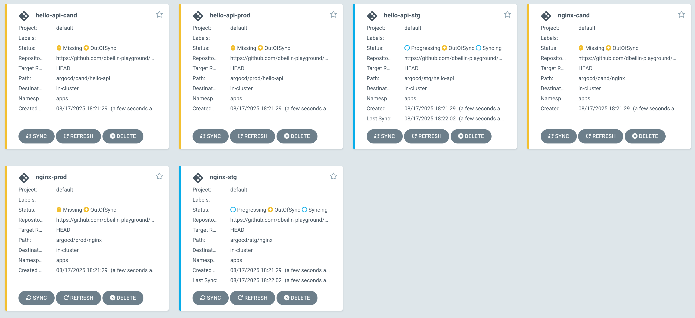

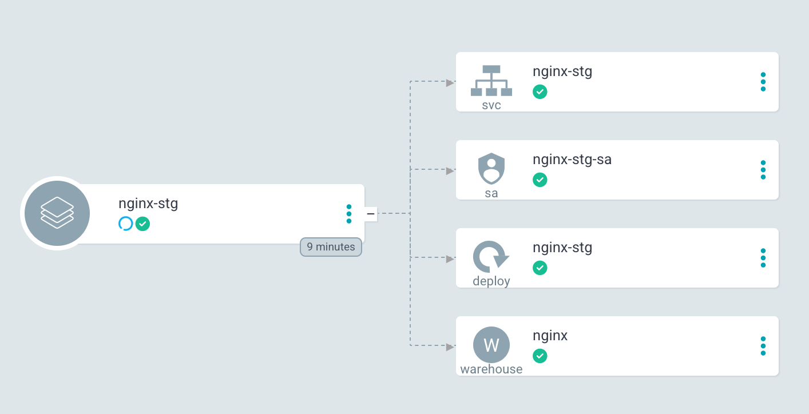

I used a simple "base app" pattern to create a single Helm template that would be applied to both `nginx` and `hello-api`. With their creation we get the following resources:
- Deployment
- Service
- ServiceAccount
- Warehouse
- Stage

Only Warehouse and Stage are Kargo CRDs, let's look at what was created:

```shell
> k get warehouses
NAME        SHARD   AGE
hello-api           3m50s
nginx               3m50s
```

Let's see the YAML of `nginx`:
```yaml
apiVersion: kargo.akuity.io/v1alpha1
kind: Warehouse
metadata:
  annotations:
    argocd.argoproj.io/tracking-id: nginx-stg:kargo.akuity.io/Warehouse:apps/nginx
    kargo.akuity.io/description: Watches nginx config changes in argocd/stg/nginx/values-image.yaml
  creationTimestamp: "2025-08-17T15:27:42Z"
  generation: 1
  name: nginx
  namespace: apps
  resourceVersion: "2842"
  uid: c2a06d23-6eba-4b28-bd14-c19e68d4ed21
spec:
  freightCreationPolicy: Automatic
  interval: 5m0s
  subscriptions:
  - git:
      commitSelectionStrategy: NewestFromBranch
      discoveryLimit: 20
      includePaths:
      - argocd/stg/nginx/values-image.yaml
      repoURL: https://github.com/dbeilin-playground/config.git
      strictSemvers: true
status:
  conditions:
  - lastTransitionTime: "2025-08-17T15:27:42Z"
    message: Successfully discovered 1 commits from 1 subscriptions
    reason: ArtifactsDiscovered
    status: "True"
    type: Ready
  - lastTransitionTime: "2025-08-17T15:27:42Z"
    message: Successfully discovered 1 commits from 1 subscriptions
    observedGeneration: 1
    reason: ArtifactsDiscovered
    status: "True"
    type: Healthy
  lastFreightID: 1a91df246d87c607b01de69a73df2119050062d7
  observedGeneration: 1
```

We can see Helm templated our `includePaths`:

```yaml
  - git:
      commitSelectionStrategy: NewestFromBranch
      discoveryLimit: 20
      includePaths:
      - argocd/stg/nginx/values-image.yaml
      repoURL: https://github.com/dbeilin-playground/config.git
      strictSemvers: true
```

The above means that the Warehouse watches `argocd/stg/nginx/values-image.yaml` in the specified repo, and when changes are detected, a new Freight will be created (we'll see Freights later).

> [!note]
> In case you missed it, each app dynamically gets a Warehouse and a Stage thanks to the [Helm values file](https://github.com/dbeilin-playground/config/tree/main/argocd/stg/nginx)

If you check out Kargo UI, you should see your first Warehouses:

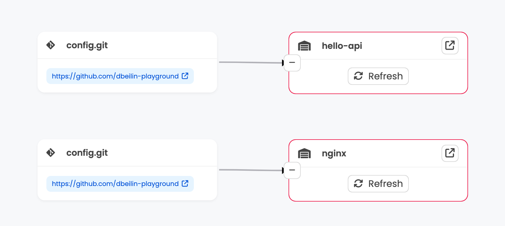

# Promotions

At this point we are ready to move forward with stages and promotions. You probably noticed that we still don't have any Stages to promote to, so let's create them.

For the `cand` environments, I configured `argocd/cand/nginx/values.yaml` with:

```yaml
  kargo:
    stage:
      enabled: true
      directFromWarehouse: true
      sourceEnv: stg
```

So let's sync them manually in ArgoCD:

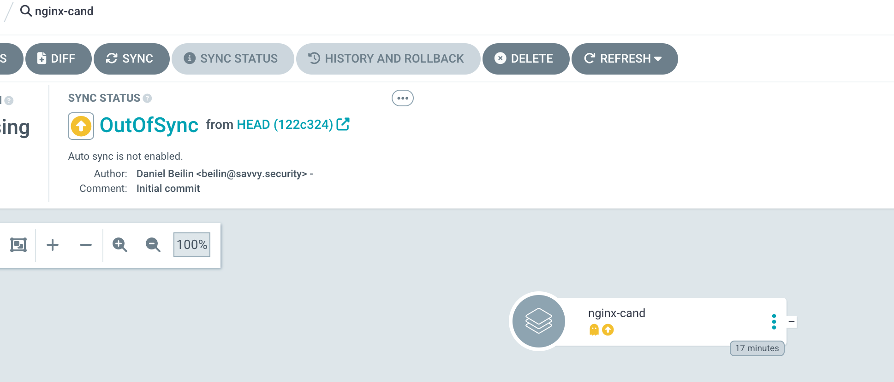

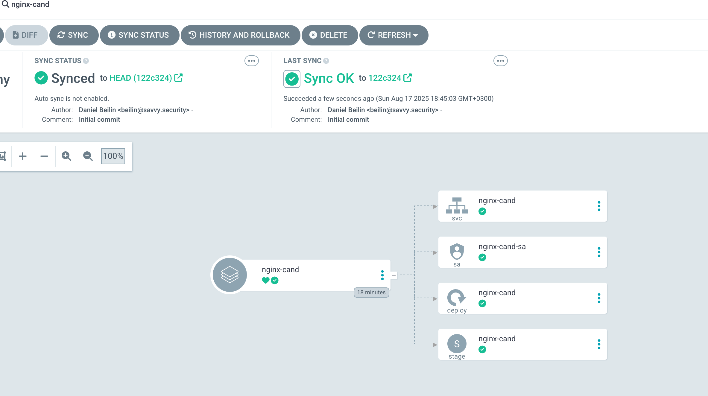

After we do the same to `hello-api`, we can return to Kargo UI and see that we have 2 new stages:

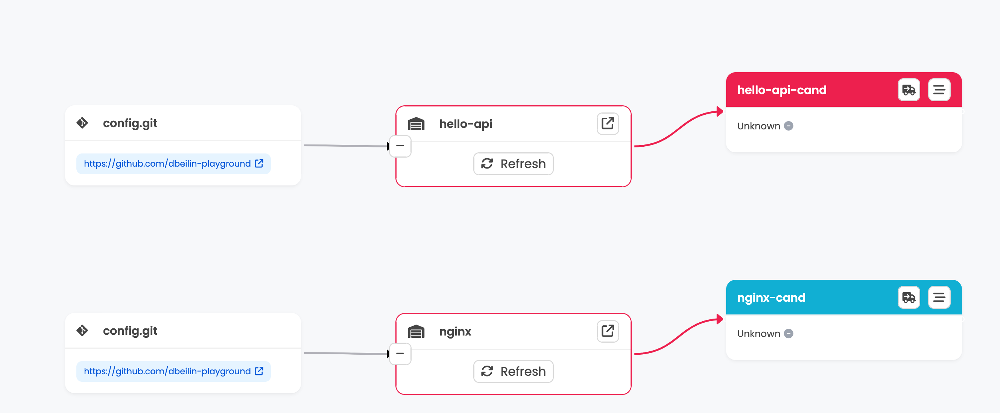

## Promotion Task

Now that have the `cand` environment ready with a stage for each app, we can try and promote `stg` to `cand`.
We don't actually have a stage for `stg`, but as mentioned previously, my CI is already building the image and publishing it to [`values-image.yaml`](https://github.com/dbeilin-playground/config/blob/main/argocd/stg/nginx/values.yaml), so all I actually want to use Kargo for is promoting `stg` to `cand` and then `cand` to `prod`.

When we promote a Freight to a stage, the promotion needs to execute a set of tasks. In my case the task was simple:
Copy the `stg` env `values-image.yaml` tag and paste it into the same app in the `cand` env. To achieve that, we need to use a [PromotionTask](https://docs.kargo.io/user-guide/reference-docs/promotion-tasks/#defining-a-promotion-task).

To make it available throughout the cluster, I decided to use a `ClusterPromotionTask`:

```yaml
apiVersion: kargo.akuity.io/v1alpha1
kind: ClusterPromotionTask
metadata:
  name: promote-between-envs
spec:
  vars:
  - name: appName      # e.g., "nginx" or "hello-api"
  - name: sourceEnv    # e.g., "stg" or "cand"
  - name: targetEnv    # e.g., "cand" or "prod"
  steps:
  - uses: git-clone
    config:
      repoURL: https://github.com/dbeilin-playground/config.git
      checkout:
      - branch: main
        path: ./config
  - uses: copy
    config:
      inPath: ./config/argocd/${{ vars.sourceEnv }}/${{ vars.appName }}/values-image.yaml
      outPath: ./config/argocd/${{ vars.targetEnv }}/${{ vars.appName }}/values-image.yaml
  - uses: git-commit
    as: commit
    config:
      path: ./config
      message: "🚀 Promote ${{ vars.appName }} ${{ vars.sourceEnv }} → ${{ vars.targetEnv }}"
      author:
        name: "Kargo Bot"
        email: "kargo@apps.com"
  - uses: git-push
    config:
      path: ./config
  - uses: argocd-update
    config:
      apps:
      - name: ${{ vars.appName }}-${{ vars.targetEnv }}
        namespace: argocd
        sources:
        - repoURL: https://github.com/dbeilin-playground/config.git
```

As you can see, the steps are simple: clone, copy tag, commit and push. I didn't enable auto-sync for my apps in `cand` and `prod` so I added a step to do it as well.
Let's run the promotion and see what we get. You can use the CLI or the UI to promote:

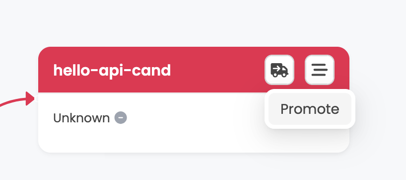

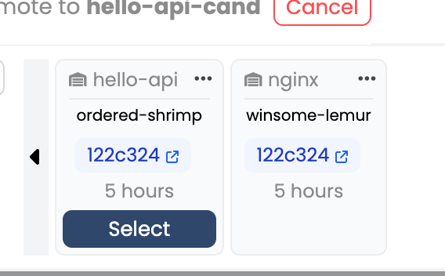

It finished successfully, we can even check out the `config` repo and see that the promotion was [commited](https://github.com/dbeilin-playground/config/commit/3f9bb771d4b1d70bd1e73894cd6dfb17eac626fb):

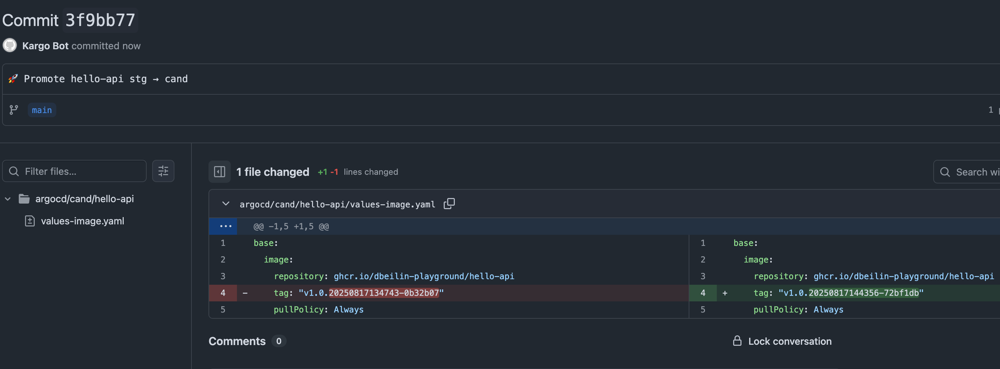

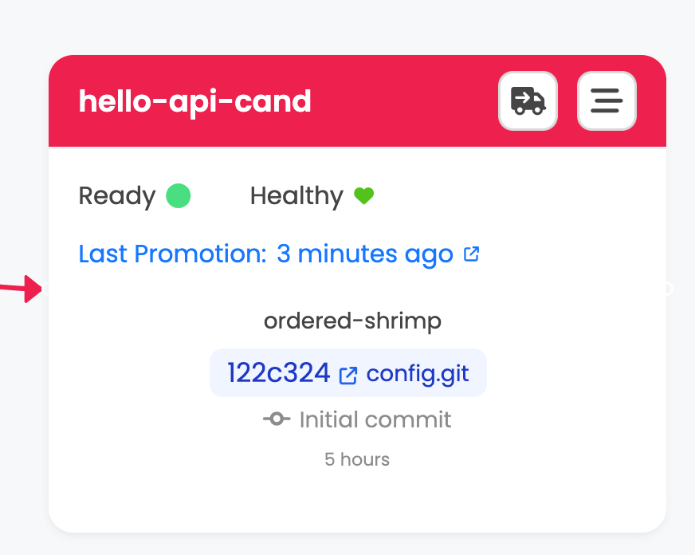

## New Freights

Let's demonstrate how new freights are recognized. In both of my demo apps, I created a workflow that builds and image and commits it to the `config` repo. Let's trigger one of them by a simple:

```shell
git commit --allow-empty -m "trigger build" ; git push
```

1. The workflow [will run](https://github.com/dbeilin-playground/hello-api/actions/runs/17025611151/job/48260586436).
2. It will [update the tag in `stg`](https://github.com/dbeilin-playground/config/commit/17393ad5634f6d043511b93c1fb74335722d33d3).
3. A new freight will be discovered:

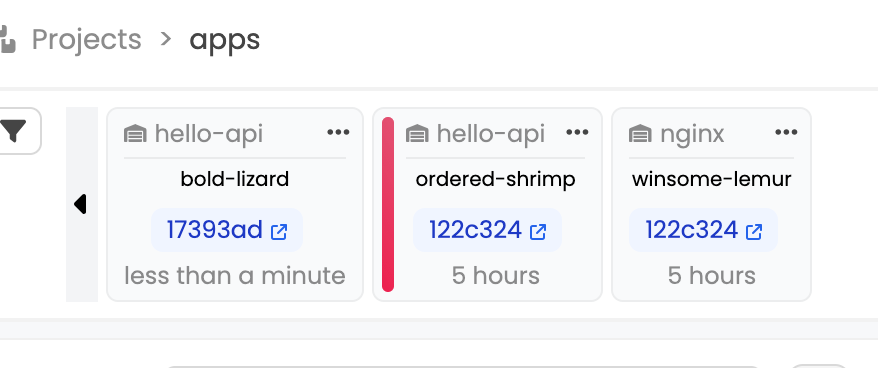

Now we can promote it as we already did


# Finishing Up

At this point, all we have to do is repeat the flow:
1. Sync `prod` apps in ArgoCD to get their respective stages.
2. Promote however we like

Hope this demo was useful to anyone :)
