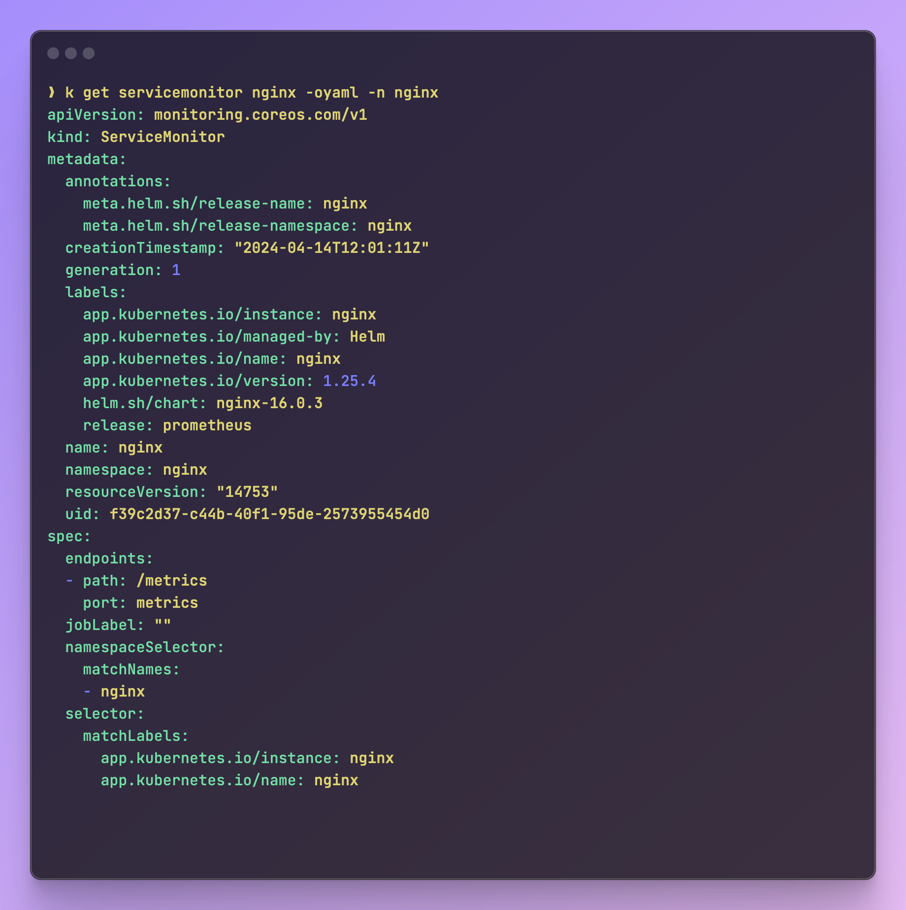
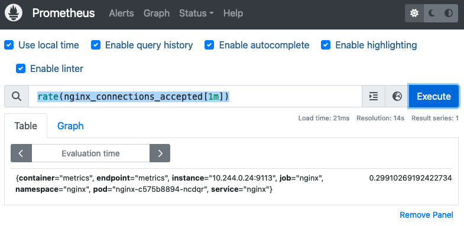
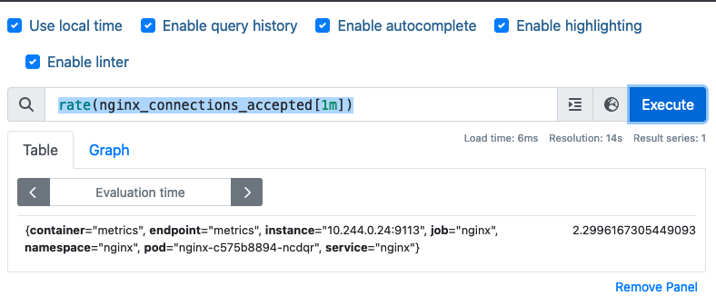
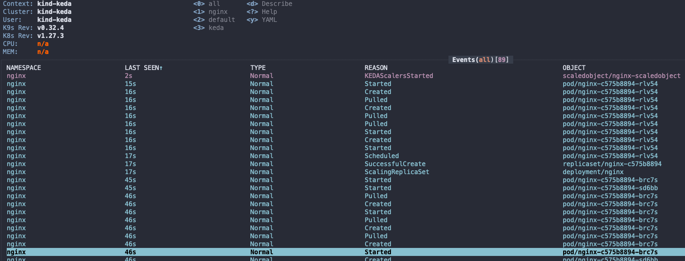
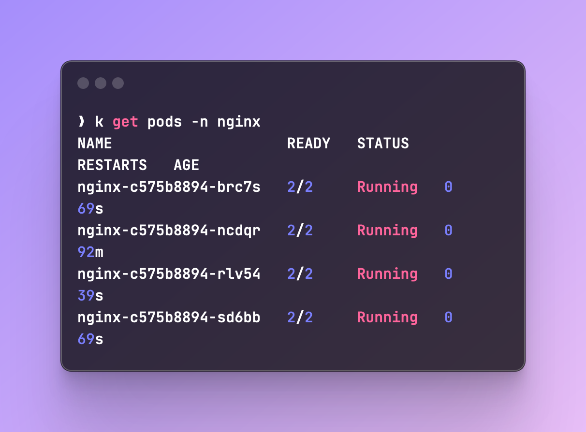

# Horizontal Pod Autoscaling with KEDA
In this guide I wanted to show you can deploy KEDA as a solution for horizontal pod autoscaling in your cluster. Unlike the default metrics server provided to you by some cloud providers, KEDA is a more flexible and powerful solution that can scale your pods based on custom metrics.
KEDA is event driven, so it can listen almost any metric you provide it with and scale your deployments accordingly. In my example I'll be using Prometheus as a metric source to scale Nginx.

## Prerequisites
Let's setup a new cluster: `kind create cluster --name keda`
After it's done, I'll install:

- KEDA
- Prometheus
- Nginx

You can install them however you want, but in this example I'll use Terraform and Helm.


```hcl title="0-providers.tf"
provider "helm" {
  kubernetes {
    config_path = "~/.kube/config"
  }
}
```

```hcl title="1-keda.tf"
resource "helm_release" "keda" {
  name = "keda"

  repository       = "https://kedacore.github.io/charts"
  chart            = "keda"
  namespace        = "keda"
  create_namespace = true
}
```

```hcl title="2-prometheus.tf"
resource "helm_release" "prometheus" {
  name = "prometheus"

  repository       = "https://prometheus-community.github.io/helm-charts"
  chart            = "kube-prometheus-stack"
  namespace        = "prometheus"
  create_namespace = true

  values = [file("values/prom-values.yaml")]
}
```

> [!tip]
> For Prometheus, I used the default values which you can get using `helm show values prometheus-community/kube-prometheus-stack`.

```hcl title="3-nginx.tf"
resource "helm_release" "nginx" {
  name = "nginx"

  repository       = "https://charts.bitnami.com/bitnami"
  chart            = "nginx"
  namespace        = "nginx"
  create_namespace = true

  values = [file("values/values.yaml")]
}
```

For Nginx's values file, I enabled `metrics` and `ServiceMonitor` and provided a `release` label:
```yaml title="values.yaml"
service:
  type: NodePort
metrics:
  enabled: true
  serviceMonitor:
    enabled: true
    labels:
      release: prometheus
```

### Checks
Let's make sure that Nginx's ServiceMonitor was applied correctly:




Great! We can see the ServiceMonitor object, as well as the target in our Prometheus.

## Trigger KEDA
Now that we have everything in place, all we need to do is to trigger KEDA and see that it scales our deployment.
For this, I chose to use `nginx_connections_accepted` as the metric on which we'll scale, but you can literally choose anything you want.

Let's deploy this following `ScaledObject` by running `kubectl apply`:
```yaml title="nginx-scaledobject.yaml"
apiVersion: keda.sh/v1alpha1
kind: ScaledObject
metadata:
  name: nginx-scaledobject
spec:
  scaleTargetRef:
    name: nginx
  pollingInterval: 5
  cooldownPeriod: 15
  maxReplicaCount: 5
  minReplicaCount: 1
  triggers:
    - type: prometheus
      metadata:
        serverAddress: http://prometheus-kube-prometheus-prometheus.prometheus.svc.cluster.local:9090
        query: rate(nginx_connections_accepted[1m])
        threshold: '1'
```

> [!note]
> Make sure to update the attributes based on your setup.

Now that this manifest is applied, let's trigger it using [k6](https://k6.io/). Here is a simple test that would send load to our endpoint:
```js title="k6-load.js"
import http from "k6/http";

export const options = {
  iterations: 10,
};

export default function () {
  const response = http.post("http://localhost:8080");
}
```

For it to work, port-forward your nginx service and update the script accordingly, then run it:
```bash
k6 run --vus 5 --duration 60s load-test.js
```

Once we run it, we should be able to see our metric go up:






You can run `kubectl events` and see the scaling process:



And lastly, running `kubectl get pods | grep nginx` we can see the 4 pods that were created:



Depending on your cooldown period, it might take a while for the pods to scale back down.

This is pretty much it. KEDA is simple, powerful and provides you with many different Scalers to use, so you don't have to base your metric on Prometheus alone of course.
