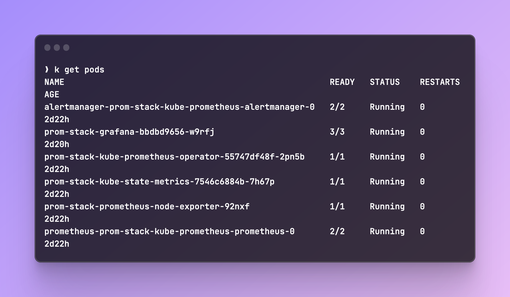
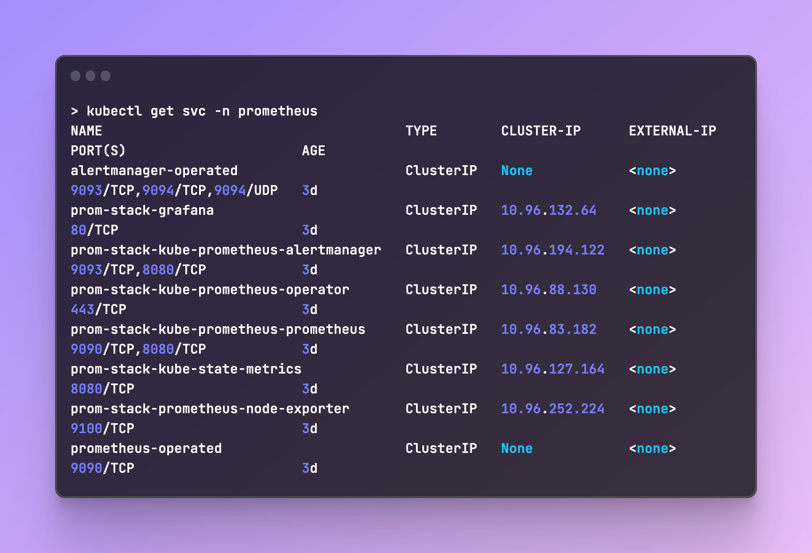
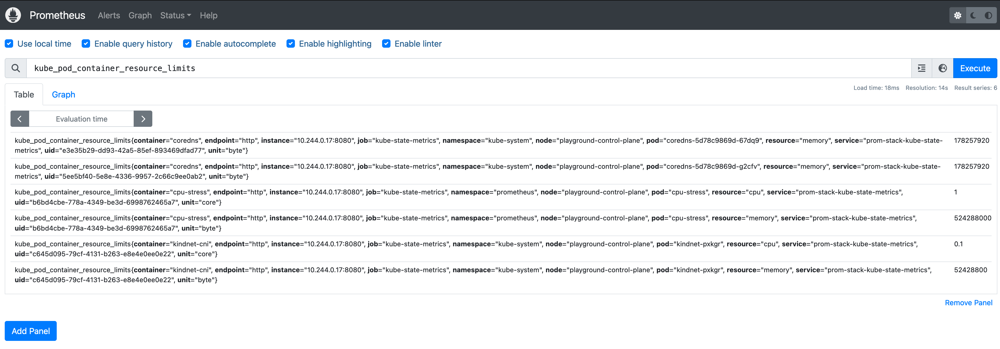

# Setup Templated Slack alerts with Alertmanager
When you configure Alertmanager to send you slack messages about your rules, it usually looks something like this:


Let's turn it into a nicer looking message, the end result should look something like this:


## Setup
I'll be using KinD to setup a local K8s cluster and Helm to install [kube-prometheus-stack](https://github.com/prometheus-community/helm-charts/tree/main/charts/kube-prometheus-stack). The community stack already includes all of the components we need for Prometheus like Alertmanager, Grafana, etc.

I'll be creating the following files in a new folder I called `prometheus`:
```bash
.
├── 0-provider.tf
├── 1-prometheus.tf
└── values
    └── values.yaml
```

1. Run `kind create cluster --name playground`
2. Create the Prometheus folder.
3. Create the `0-provider.tf` file and let's configure Helm as our provider:
   ```hcl title="0-provider.tf"
   provider "helm" {
     kubernetes {
       config_path = "~/.kube/config"
     }
   }
   ```
4. Now create `1-prometheus.tf` and configure our helm values:
   ```tf title="1-prometheus.tf"
   resource "helm_release" "prom-stack" {
     name = "prom-stack"

     repository       = "https://prometheus-community.github.io/helm-charts"
     chart            = "kube-prometheus-stack"
     namespace        = "prometheus"
     create_namespace = true

     values = [file("values/values.yaml")]
   }
   ```

> [!tip]
> You can also avoid using Terraform by simply installing the chart manually:
> ```bash
> helm repo add prometheus-community https://prometheus-community.github.io/helm-charts
> helm repo update
> helm install [RELEASE_NAME] prometheus-community/kube-prometheus-stack
> ```

1. Get the chart's values and save them under `values/values.yaml`:
```bash
helm show values prometheus-community/kube-prometheus-stack > values/values.yaml
```
1. Run `terraform init` and then `terraform apply`. You should get a bunch of new pods, deployments, services:


## Configuring Rules
Now that we have Prometheus installed, let's configure some rules.
I went with simple alerts for memory and CPU usage based on the resource limits.

Create `rules.yaml` and paste in the following manifest:
```yaml title="rules.yaml"
apiVersion: monitoring.coreos.com/v1
kind: PrometheusRule
metadata:
  labels:
    role: alert-rules
  name: custom-rules
  namespace: prometheus
spec:
  groups:
  - name: General Applicable Alerts
    rules:
    - alert: high_cpu_usage_resource_limits
      expr: >
        (
          sum by (container, pod, namespace) (rate(container_cpu_usage_seconds_total[1m]))
        ) 
        / 
        (
          sum by (container, pod, namespace) (kube_pod_container_resource_limits{resource="cpu"})
        ) > 0.9
      for: 1m
      labels:
        severity: warning
      annotations:
        summary: "High CPU usage in {{$labels.pod}}"
        description: "Container *{{$labels.container}}* in pod *{{$labels.pod}}* is consuming *{{ $value | humanizePercentage }}* of its CPU limit"

    - alert: high_memory_usage_resource_limits
      expr: >
        (
          sum by (container, pod, namespace) (container_memory_usage_bytes)
        ) 
        / 
        (
          sum by (container, pod, namespace) (kube_pod_container_resource_limits{resource="memory"})
        ) > 0.9
      for: 1m
      labels:
        severity: warning
      annotations:
        summary: "High memory usage in {{$labels.pod}}"
        description: "Container *{{$labels.container}}* in pod *{{$labels.pod}}* is consuming *{{ $value | humanizePercentage }}* of its memory limit"
```

We're using the `kube_pod_container_resource_limits` metric to fetch the resource limits and the other metrics are calculating the CPU and memory usage on the pods.

### Testing The Metrics
Let's port-forward Prometheus and query those metrics. You can run `kubectl get svc -n <namespace>` to fetch the services you need:


Now let's port-forward Prometheus: `kubectl port-forward svc/prom-stack-kube-prometheus-prometheus 9090:9090 -n prometheus`

You should be able to access Prometheus on `http://localhost:9090` and run the metric we used: `kube_pod_container_resource_limits`


The above returns all of our pods that this metric exposes. You can filter the `resource` to only get CPU or Memory results. It's also nice to see Prometheus helping with auto-completion:


Let's run one of our rules to see what we get:

```promql
(
  sum by (container, pod, namespace) (container_memory_usage_bytes)
) 
/ 
(
  sum by (container, pod, namespace) (kube_pod_container_resource_limits{resource="memory"})
)
```
The result is the ratio of memory used based on the resource's limits:


We can multiply by 100 to get the percentage, but we will handle that in the templating later.

## Send Alerts
Now that we have our rules setup and ready, let's setup alerts for our Slack Channel.
Go ahead and create a [webhook](https://api.slack.com/messaging/webhooks) for your Slack channel. It takes a couple of minutes.

1. Go to the `values.yaml` file we created for the Prometheus stack and under `alertmanager.config`, you should be able to find `route`. Paste in the following config:
   ```yaml title="values.yaml"
   route:
     group_by: ['alertname', 'container', 'pod', 'namespace']
     group_wait: 30s
     group_interval: 1m
     repeat_interval: 3h
     receiver: 'slack-notifications'
     routes:
     - receiver: 'slack-notifications'
       matchers:
         - alertname = "Watchdog"
   receivers:
   - name: 'null'
   - name: 'slack-notifications'
     slack_configs:
     - send_resolved: false
       text: "{{ range .Alerts }}{{ .Annotations.description }}\n{{ end }}"
       api_url: 'your-slack-webhook'
   templates:
   - '/etc/alertmanager/config/*.tmpl'
   ```
3. Run `tf apply` to apply the new values.
4. Open your `rules.yaml` file and change the threshold (`0.9`) to `0.1`.
5. Run `kubectl apply -f rules.yaml -n prometheus` to apply the `PrometheusRule` manifest to your cluster.
6. You can verify those rules applied by checking the Prometheus UI:
   
7. Wait for a trigger, within a few minutes you should get your first alert, assuming one of your pods is using more than 10% of it's memory limits. You can always lower the threshold if you want.
   

### Test CPU Rules
This part is optional, but you can test a CPU using a tool like [stress](https://manpages.ubuntu.com/manpages/bionic/man1/stress.1.html).

1. Create a Pod with resource limits:
   ```yaml title="stress-pod.yaml"
   apiVersion: v1
   kind: Pod
   metadata:
     name: cpu-stress
   spec:
     containers:
     - name: cpu-stress
       image: ubuntu
       command: ["/bin/bash", "-c", "--"]
       args: ["while true; do sleep 30; done;"]
       resources:
         requests:
           cpu: "500m"
           memory: "256Mi"
         limits:
           cpu: "1000m"
           memory: "500Mi"
   ```
2. Exec into it: `kubectl exec -it cpu-stress -- bash`
3. Run `apt-get update && apt-get install -y stress`
4. Run `stress --cpu 1`. A single core will be enough to trigger the alert, as we only allow one core as the limit of the pod anyway.

## Templating Alerts
We'll be using [Monzo's Alertmanager Slack templates](https://gist.github.com/milesbxf/e2744fc90e9c41b47aa47925f8ff6512) as our Slack templates.
In another method of deploying Alertmanager, you would be able to create the template manually inside of the alertmanager pod. In our case, we'll add this template inside of our `values.yaml` file. It might not be the cleanest method, but for our demo this should do just fine :)

1. Under the same place we edited earlier (`alertmanager.config`), you can paste in the following:
```yaml title="values.yaml"
    route:
      group_by: ['alertname', 'container', 'pod', 'namespace']
      group_wait: 30s
      group_interval: 1m
      repeat_interval: 4h
      receiver: 'slack-notifications'
      routes:
      - receiver: 'slack-notifications'
        matchers:
          - alertname = "Watchdog"
    receivers:
    - name: 'null'
    - name: 'slack-notifications'
      slack_configs:
      - send_resolved: false
        api_url: 'Slack-webhook-URL'
        title: '{{ template "slack.monzo.title" . }}'
        icon_emoji: '{{ template "slack.monzo.icon_emoji" . }}'
        color: '{{ template "slack.monzo.color" . }}'
        text: '{{ template "slack.monzo.text" . }}'
        actions:
          - type: button
            text: "Runbook :green_book:"
            url: "{{ (index .Alerts 0).Annotations.runbook }}"
          - type: button
            text: "Query :mag:"
            url: '{{ template "__generator_url_link" . }}'
          - type: button
            text: "Logs :grafana:"
            url: "{{ (index .Alerts 0).Annotations.logs }}"
          - type: button
            text: "Silence :no_bell:"
            url: '{{ template "__alert_silence_link" . }}'
          - type: button
            text: '{{ template "slack.monzo.link_button_text" . }}'
            url: "{{ .CommonAnnotations.link_url }}"
    # templates:
    # - '/etc/alertmanager/config/*.tmpl'
    templates: ["/etc/alertmanager/config/template_1.tmpl"]
  templateFiles:
    template_1.tmpl: |-
      {{ define "__generator_url_link" -}}
          https://thanos.${base_domain}/alerts
      {{- end }}
      {{ define "__alert_silence_link" -}}
          {{ .ExternalURL }}/#/silences/new?filter=%7B
          {{- range .CommonLabels.SortedPairs -}}
              {{- if ne .Name "alertname" -}}
                  {{- .Name }}%3D"{{- .Value -}}"%2C%20
              {{- end -}}
          {{- end -}}
          alertname%3D"{{ .CommonLabels.alertname }}"%7D
      {{- end }}
      {{ define "__alert_severity_prefix" -}}
          {{ if ne .Status "firing" -}}
          :warning:
          {{- else if eq .Labels.severity "critical" -}}
          :this-is-fine-fire:
          {{- else if eq .Labels.severity "warning" -}}
          :warning:
          {{- else -}}
          :curse-you-he-man:
          {{- end }}
      {{- end }}
      {{ define "__alert_severity_prefix_title" -}}
          {{ if ne .Status "firing" -}}
          :warning:
          {{- else if eq .CommonLabels.severity "critical" -}}
          :this-is-fine-fire:
          {{- else if eq .CommonLabels.severity "warning" -}}
          :warning:
          {{- else if eq .CommonLabels.severity "info" -}}
          :information_source:
          {{- else -}}
          :curse-you-he-man:
          {{- end }}
      {{- end }}
      {{/* First line of Slack alerts */}}
      {{ define "slack.monzo.title" -}}
          [{{ .Status | toUpper -}}
          {{ if eq .Status "firing" }}:{{ .Alerts.Firing | len }}{{- end -}}
          ] {{ template "__alert_severity_prefix_title" . }} {{ .CommonLabels.alertname }}
      {{- end }}
      {{/* Color of Slack attachment (appears as line next to alert )*/}}
      {{ define "slack.monzo.color" -}}
          {{ if eq .Status "firing" -}}
              {{ if eq .CommonLabels.severity "warning" -}}
                  warning
              {{- else if eq .CommonLabels.severity "critical" -}}
                  danger
              {{- else -}}
                  #439FE0
              {{- end -}}
          {{ else -}}
          good
          {{- end }}
      {{- end }}
      {{/* Emoji to display as user icon (custom emoji supported!) */}}
      {{ define "slack.monzo.icon_emoji" }}:prometheus:{{ end }}
      {{/* The test to display in the alert */}}
      {{ define "slack.monzo.text" -}}
      {{ range .Alerts }}
      {{- if .Annotations.message }}
      {{ .Annotations.message }}
      {{- end }}
      {{- if .Annotations.description }}
      {{ .Annotations.description }}
      {{- end }}
      {{- end }}
      {{- end }}
      {{- /* If none of the below matches, send to #monitoring-no-owner, and we 
      can then assign the expected code_owner to the alert or map the code_owner
      to the correct channel */ -}}
      {{ define "__get_channel_for_code_owner" -}}
          {{- if eq . "platform-team" -}}
              platform-alerts
          {{- else if eq . "security-team" -}}
              security-alerts
          {{- else -}}
              monitoring-no-owner
          {{- end -}}
      {{- end }}
      {{- /* Select the channel based on the code_owner. We only expect to get
      into this template function if the code_owners label is present on an alert.
      This is to defend against us accidentally breaking the routing logic. */ -}}
      {{ define "slack.monzo.code_owner_channel" -}}
          {{- if .CommonLabels.code_owner }}
              {{ template "__get_channel_for_code_owner" .CommonLabels.code_owner }}
          {{- else -}}
              monitoring
          {{- end }}
      {{- end }}
      {{ define "slack.monzo.link_button_text" -}}
          {{- if .CommonAnnotations.link_text -}}
              {{- .CommonAnnotations.link_text -}}
          {{- else -}}
              Link
          {{- end }} :link:
      {{- end }}
```
   This is more or less Monzo's template with a few slight changes.

2. run `tf apply` to apply the changes to our stack.
3. The `templateFiles` attribute is loaded a secret to Alertmanager. You can verify the new template `template_1.yml` applied by running: `kubectl get secret -o yaml alertmanager-prom-stack-kube-prometheus-alertmanager`:
   ```yaml
   apiVersion: v1
   data:
     alertmanager.yaml: Z2xvYmFsOgogIHJlc29sdsdfRTd1.....==
     template_1.tmpl: e3sgZGVmaW5lICJfX2dlbmVyYXRvcl.....==
   kind: Secret
   metadata:
     annotations:
       meta.helm.sh/release-name: prom-stack
       meta.helm.sh/release-namespace: prometheus
     creationTimestamp: "2024-01-29T11:33:46Z"
     labels:
       app: kube-prometheus-stack-alertmanager
       app.kubernetes.io/instance: prom-stack
       app.kubernetes.io/managed-by: Helm
       app.kubernetes.io/part-of: kube-prometheus-stack
       app.kubernetes.io/version: 56.2.1
       chart: kube-prometheus-stack-56.2.1
       heritage: Helm
       release: prom-stack
     name: alertmanager-prom-stack-kube-prometheus-alertmanager
     namespace: prometheus
     resourceVersion: "1218773"
   type: Opaque
   ```
   To save us a wall of text, I truncated the base64 output that you would see under `template_1.tmpl`.
4. Without any changes to our rules, our new alert should look like this:


> [!tip]
> If you're having issues with getting alerts, you can run `kubectl logs -f alertmanager-prom-stack-kube-prometheus-alertmanager` to see the logs of alertmanager.

### How do I get that Grafana link?
Optionally, you can add a Grafana botton by adding some of the Annotations that we get from the template. In my case, I added the `logs` label to my rule:
```yaml title="rules.yaml"
 - alert: high_memory_usage_resource_limits
   expr: >
     (
       sum by (container, pod, namespace) (container_memory_usage_bytes)
     ) 
     / 
     (
       sum by (container, pod, namespace) (kube_pod_container_resource_limits{resource="memory"})
     ) > 0.9
   for: 1m
   labels:
     severity: warning
   annotations:
     summary: "High memory usage in {{$labels.pod}}"
     description: "Container *{{$labels.container}}* in pod *{{$labels.pod}}* is consuming *{{ $value | humanizePercentage }}* of its memory limit"
     logs: http://localhost:8080/d/k8s_views_pods/kubernetes-views-pods?orgId=1&refresh=30s&var-datasource=prometheus&var-cluster=&var-namespace={{$labels.namespace}}&var-pod={{$labels.pod}}&var-resolution=1m&var-job=kube-state-metrics
```

By default, the Monzo annotation refers to `dashboard` as the label, but I edited it to work as `logs`. Under this label you can post your Grafana URL with the labels from the query, which would bring you exactly to the Pod's stats (assuming your dashboard supports it).

That's it!
